# SecureD - A Password Generator/Vault []()

# Team Members with Discord handles
1. Nakshatra Gupta (nuke#7232)
2. Aanchal Chaurasia (AanchalChaurasia#1446)
3. Anand Srivastav (Anand#7508)

# Project Description
1. It is an open source Android application that allows people to generate and copy safe and secure passwords using an algorithm implemented in Java.
2. An android app mplementing room persistence library, live data and MDC Components.
3. App architecture - MVVM architecture.
4. The user can generate password by customizing the length, characters etc or choose to generate password by default method with a very user friendly UI and amazing security features.
5. He/She can choose to delete saved passwords as and when required.
6. The user can enable fingerprint authentication for app and choose to view the app in light or dark mode as per convenience.
7. Personalization - User can add his/her Avatar and name in the app (Comfy Settings)

# Who did we design this App for?
Everyone as all of us needs to store password and use them in future. UI is designed in such a way that even a small child can use it efficiently without any confusion. UX is designed for the users on go so that they can use it efficiently.
# Inspiration for this Project
We decided to take part in CODE JAM by Tech with Tim, a 30 days long hackathon with the theme "Generator". The three of us did a lot of brainstorming and then came up with the 
idea of a "Password Generator" app. We came up with quite a few challenges and learnt a lot solving them. 
# Download the App
[]()
# Screenshots

##### Splash with and without Fingerprint-Auth
 
<br>
##### Main app screen
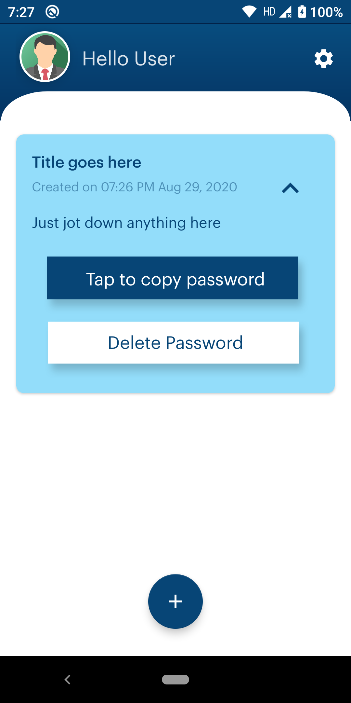 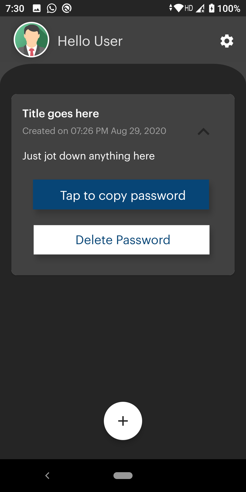
<br>
##### Personalize with Profile Pic
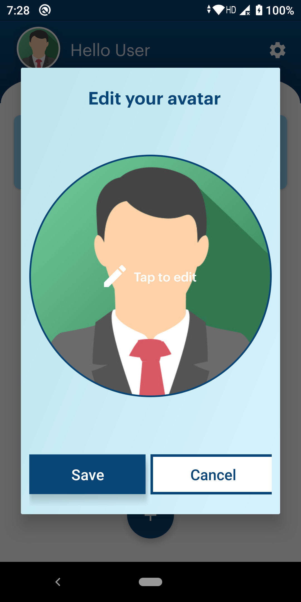 
<br>
##### Personalize with Profile Name
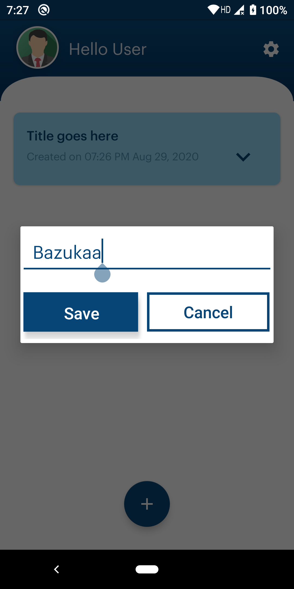 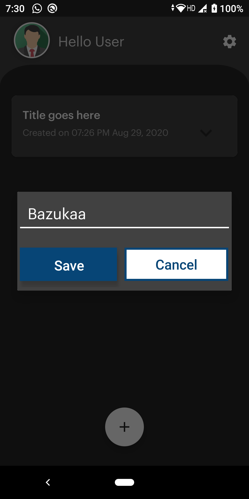
<br>
##### Generate Password with Default Settings
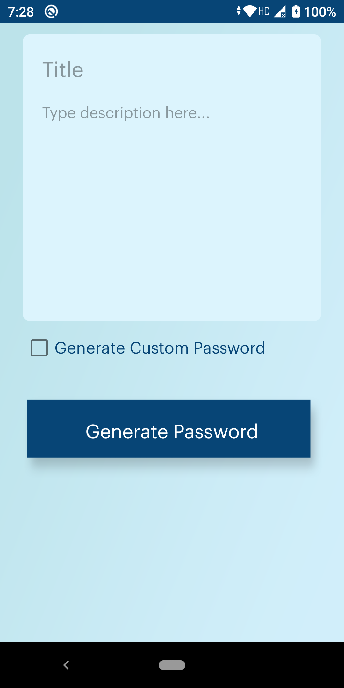 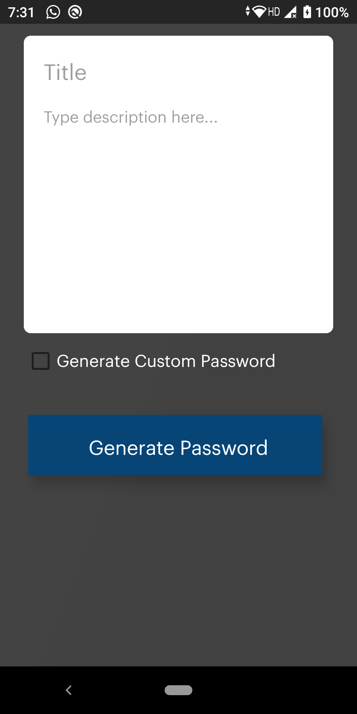
<br>
##### Generate Password with Custom Settings
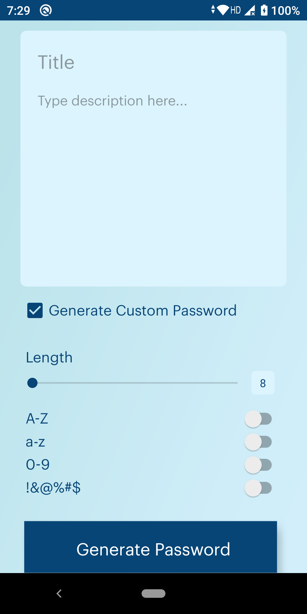 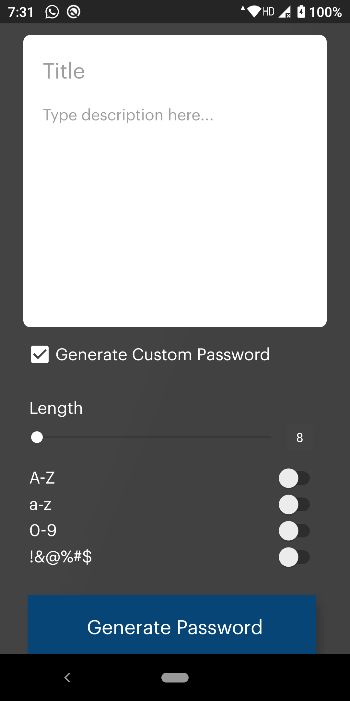
<br>
##### App Settings
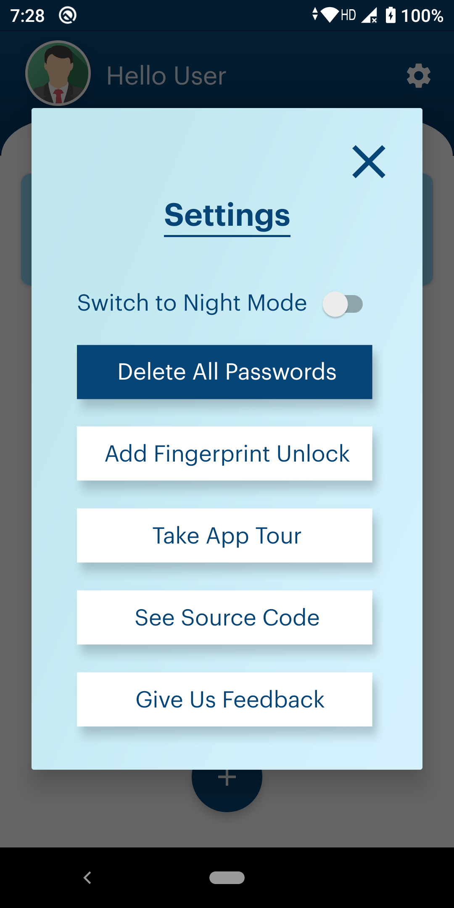 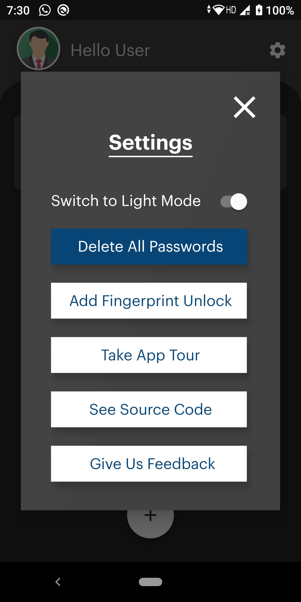
<br>
##### Dialog asking to confirm Delete all passwords
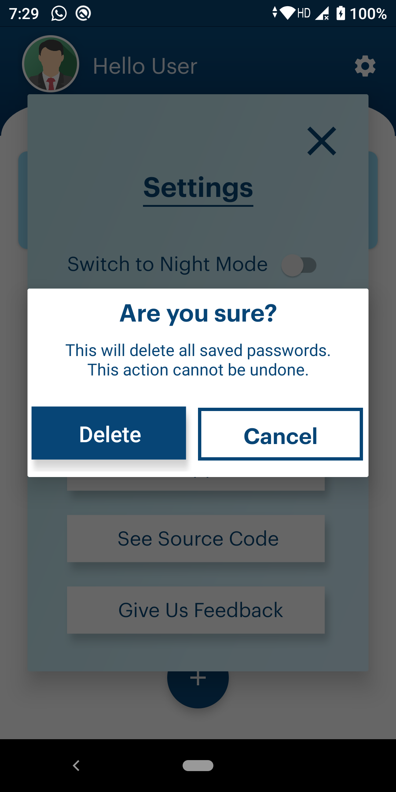 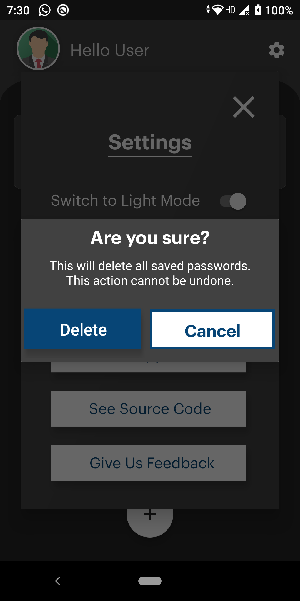
<br>
##### Enable Fingerprint-Auth
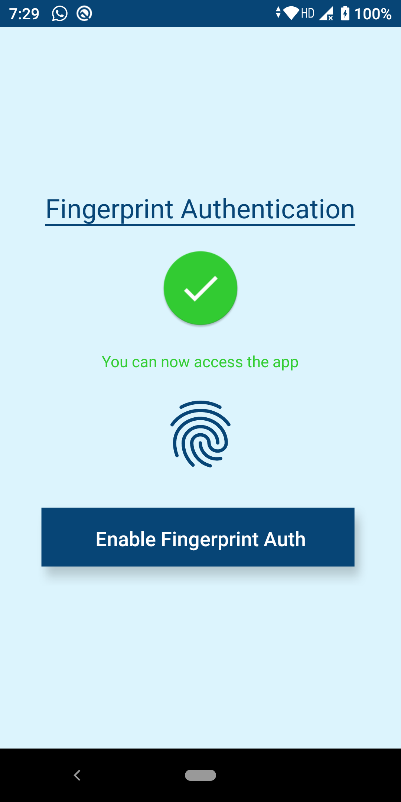 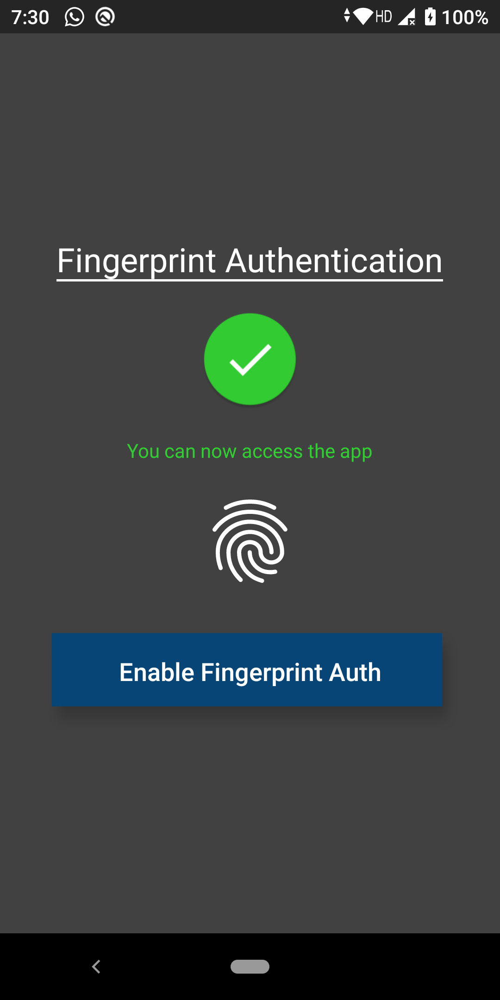


# Contributions
Contributions are welcome.
1. Submit an [issue](https://github.com/nakshatra-bazukaa/Noted/issues) describing your proposed fix or feature.
2. If your proposed fix or feature is accepted then, fork, implement your code change.
3. Ensure your code change follows the **standard code style and structure**.
4. Ensure your code is properly tested.
5. Ensure your commits follow the **standard commit message style**
6. Submit a pull request.

## Installation for Contributions
Clone this repository and import into **Android Studio**
```bash
git clone https://github.com/nakshatra-bazukaa/news-app-2.git
```
